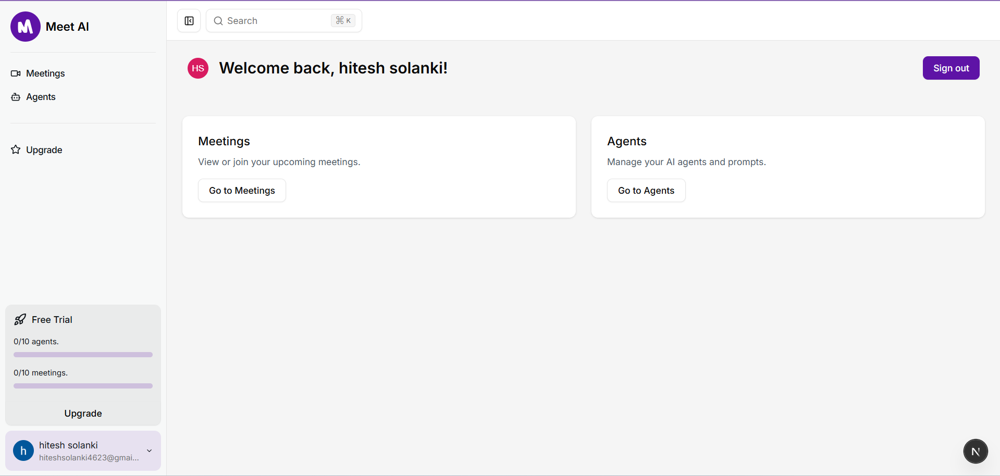
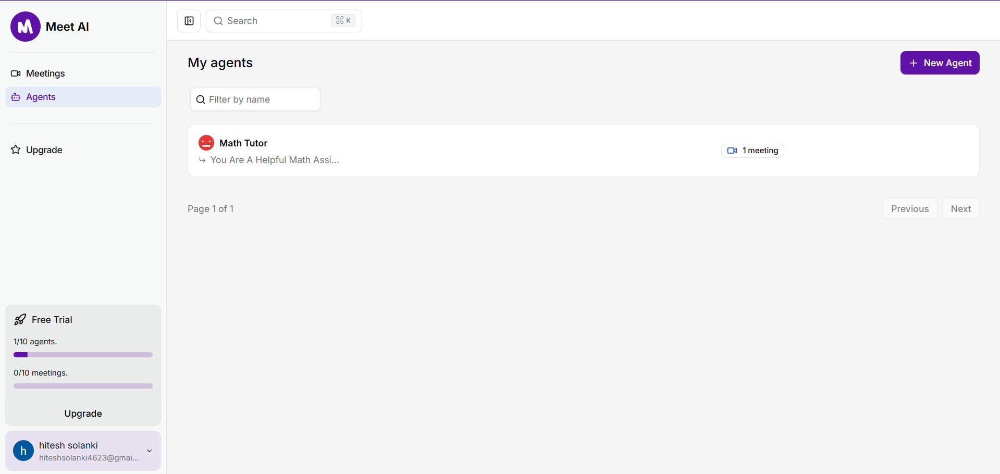
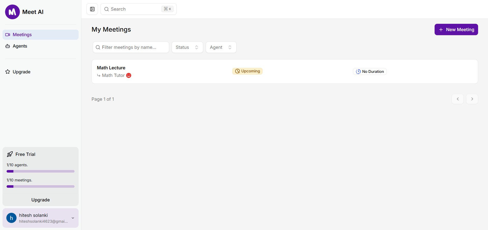
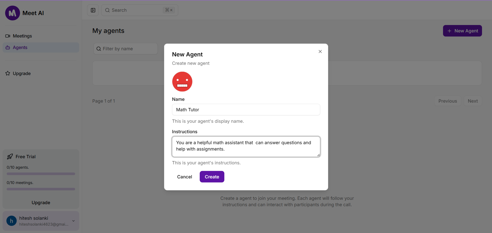
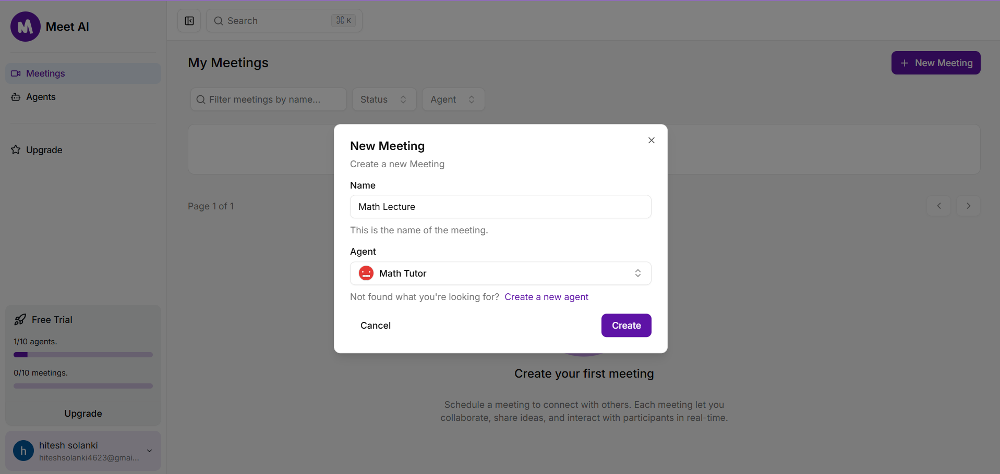
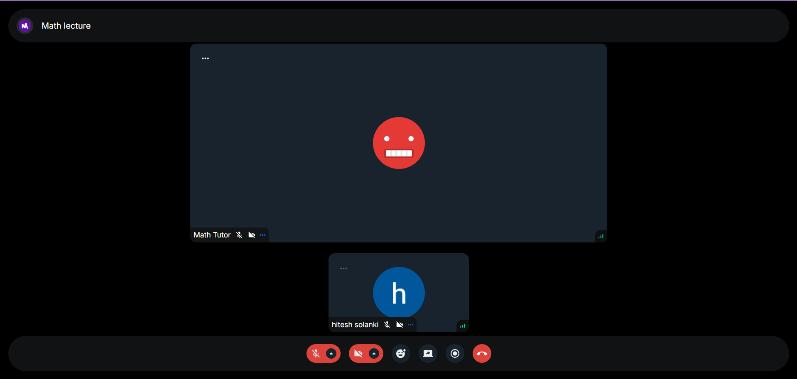

# Meet AI

> A real-time, AI-powered video & chat platform—create your own AI “agents,” schedule meetings, and collaborate seamlessly in the browser.



## Features

- **AI Agents**  
  – Define custom “agents” with instructions  
  – See your agents list and how many meetings each has hosted

- **Meeting Scheduler**  
  – 🔮 Schedule new meetings and assign an agent  
  – 🗓️ Filter by name, status, or agent  
  – 📅 See upcoming vs. past meetings

- **In-Meeting Experience**  
  – Real-time video powered by Stream (WebRTC)  
  – Integrated chat powered by Stream Chat React + TRPC  
  – Mute/unmute, screen-share, reactions, and more

- **Authentication & Profiles**  
  – Simple “Magic Link” or token-based session (via `authClient`)  
  – Per-user data isolation

## Tech Stack

- **Framework**: Next.js 14 (“App Router” / `"use client"`)
- **Styling**: Tailwind CSS
- **Video & Chat**:
  - [Stream Video (stream-io/stream-video-react)](https://getstream.io/video-react/)
  - [Stream Chat React](https://github.com/GetStream/stream-chat-react)
- **API Layer**: tRPC (React Query + Zod)
- **Authentication**: Custom `authClient` (Magic link / token)
- **Language**: TypeScript
- **Hosting**: Vercel / any Node-capable host

## Screenshots

### Agents List



### Meetings List



### Create New Agent



### Create New Meeting



### In-Meeting View



## Getting Started

### Prerequisites

- Node.js ≥ 18
- npm or Yarn
- A Stream account with **Video** & **Chat** API keys
- Your favorite code editor (VSCode, WebStorm, etc.)

### Installation

1. **Clone the repo**
   ```bash
   git clone https://github.com/Hitesh-s0lanki/meet-ai.git
   cd meet-ai
   ```
